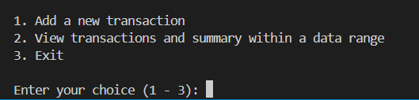
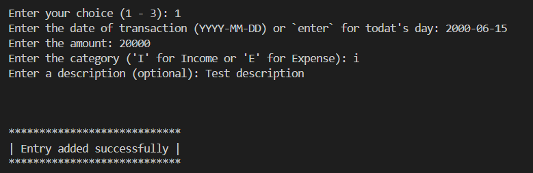
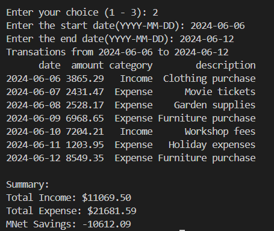
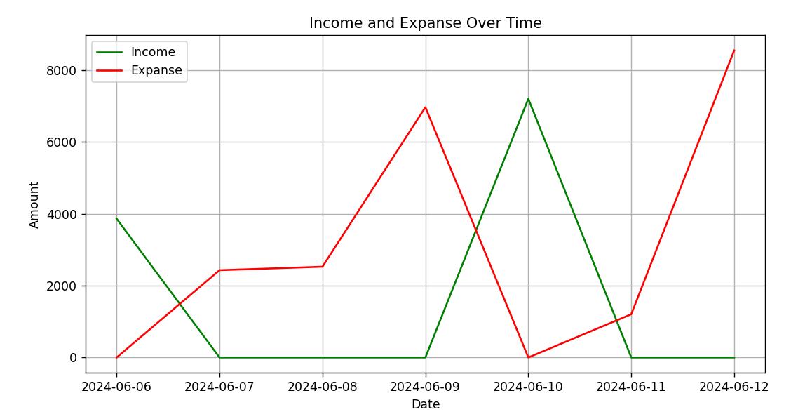

# Financial Transactions Management App

This application allows you to manage financial transactions entirely through the terminal. You can add new entries, view transactions within a date range, and plot income and expenses over time.

## Features

- **Add New Transactions:** Enter details such as date, amount, category (Income or Expense), and an optional description.
  
- **View Transactions:** Filter transactions by date range and view a summary of income, expenses, and net savings.

- **Plot Transactions:** Visualize income and expenses over time with interactive plots.

## Getting Started

### Prerequisites

- Python 3.10 or higher
- Dependencies listed in `requirements.txt`

### Installation

Clone the repository and navigate into the project directory:

```bash
git clone <repository-url>
cd <project-directory>
```

Install dependencies:

```bash
pip install -r requirements.txt
```

### Running the Application

#### With Docker

1. Build the Docker image:

   ```bash
   docker build -t financial-app .
   ```

2. Run the Docker container:

   ```bash
   docker run -it financial-app
   ```

#### Without Docker

1. Run the application:

   ```bash
   python main.py
   ```

## Usage

1. **Adding a New Transaction:** Choose option 1 from the menu, enter transaction details including date, amount, category (Income or Expense), and optional description.
  
2. **Viewing Transactions:** Choose option 2 from the menu, enter a start and end date to view transactions within that range. You can also choose to plot the income and expense trends over time.

3. **Exiting:** Choose option 3 from the menu to exit the application.

## App look like this:


--------------

--------------

--------------

--------------
## Notes

- Transactions are stored in a CSV file (`transactions.csv`).
- Date format expected: YYYY-MM-DD.
- Categories: 'I' for Income and 'E' for Expense.